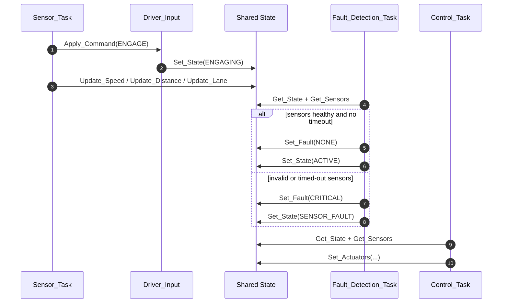
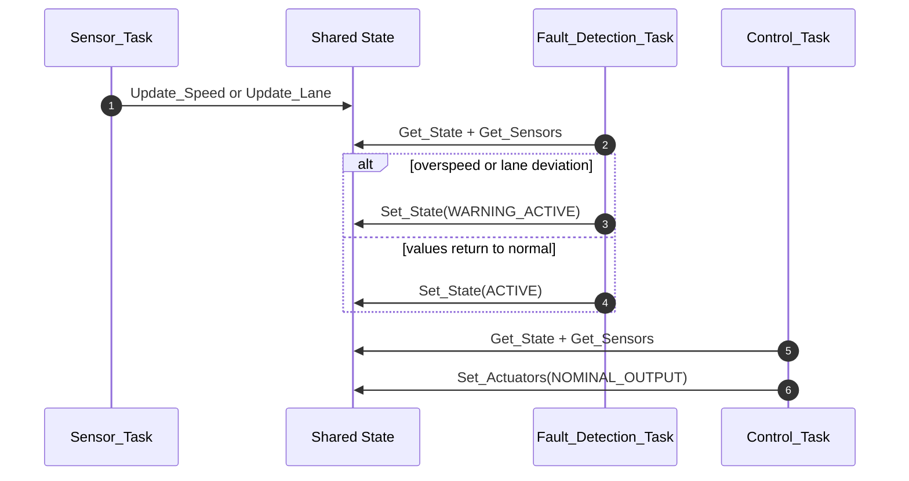
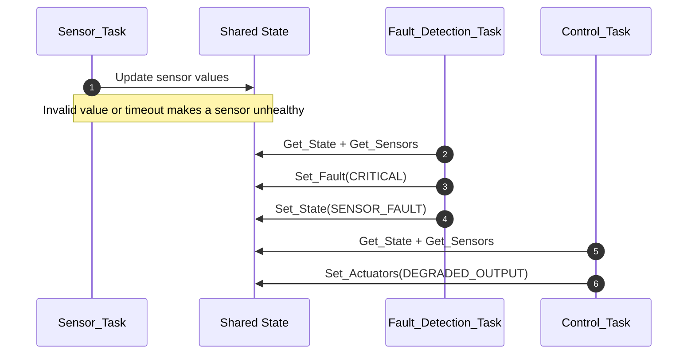
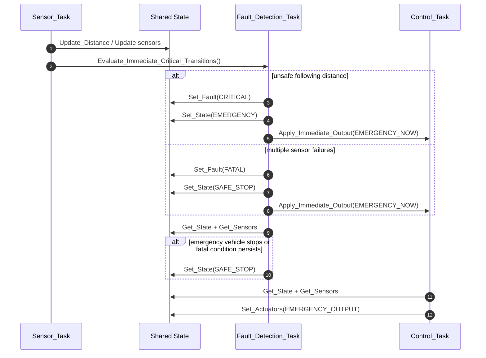
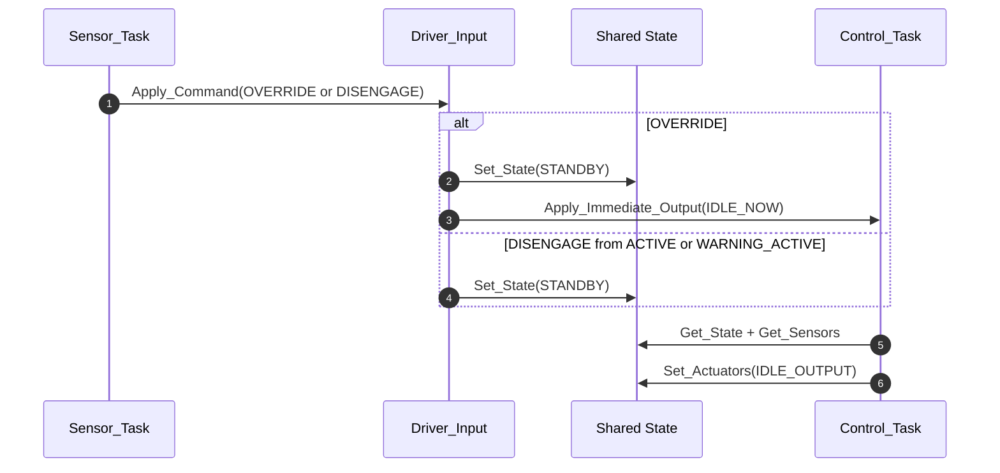

# Ada Internal Sequence Patterns

These diagrams focus on the main runtime collaboration inside Ada.

They are based on the state machine described in
[ADAS State Transition Diagram](./adas_state_transition_diagram.md).

Notes:

- `Shared State` is the protected object used by the Ada tasks to exchange state,
  fault, sensor, and actuator values.
- During scenario replay, `Sensor_Task` reuses `Driver_Input.Apply_Command(...)`
  directly. The `Driver_Input_Task.Send_Command` entry exists for external
  command delivery, but the replay path uses the shared command logic
  synchronously.

## Pattern 1: Normal Engage

## Pattern 2: Warning And Recovery

## Pattern 3: Sensor Fault

## Pattern 4: Emergency To Safe Stop

## Pattern 5: Override Or Disengage

