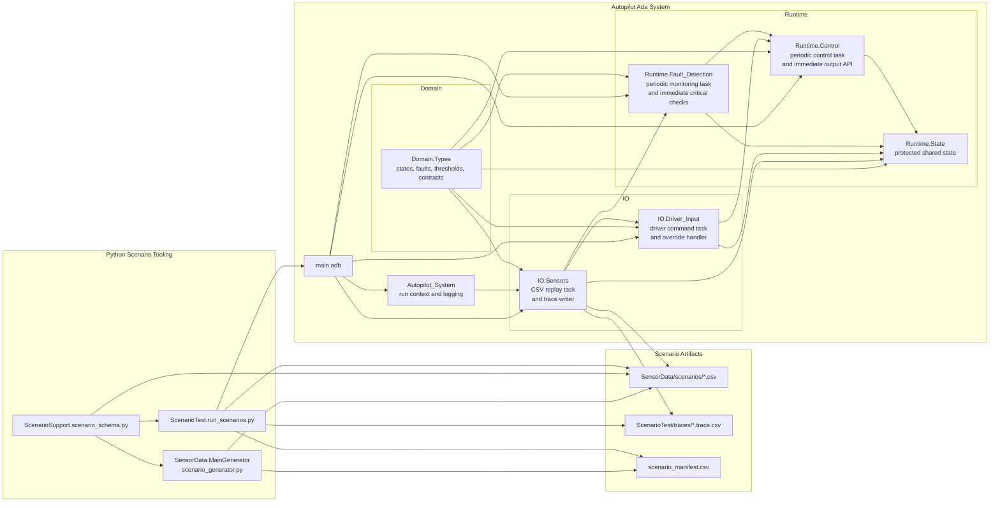

# ADAS Component Diagram

This diagram shows the current implementation structure: the Ada runtime packages, the scenario replay interfaces, and the Python scenario tooling around them.

```mermaid
flowchart LR
    subgraph PY[Python Scenario Tooling]
        GEN[SensorData.MainGenerator<br/>scenario_generator.py]
        RUN[ScenarioTest.run_scenarios.py]
        SCHEMA[ScenarioSupport.scenario_schema.py]
    end

    subgraph FILES[Scenario Artifacts]
        CSV[SensorData/scenarios/*.csv]
        TRACE[ScenarioTest/traces/*.trace.csv]
        MANIFEST[scenario_manifest.csv]
    end

    subgraph ADA[Autopilot Ada System]
        MAIN[main.adb]
        ROOT[Autopilot_System<br/>run context and logging]

        subgraph DOMAIN[Domain]
            TYPES[Domain.Types<br/>states, faults, thresholds, contracts]
        end

        subgraph RUNTIME[Runtime]
            STATE[Runtime.State<br/>protected shared state]
            CONTROL[Runtime.Control<br/>periodic control task<br/>and immediate output API]
            FAULT[Runtime.Fault_Detection<br/>periodic monitoring task<br/>and immediate critical checks]
        end

        subgraph IO[IO]
            SENSORS[IO.Sensors<br/>CSV replay task<br/>and trace writer]
            DRIVER[IO.Driver_Input<br/>driver command task<br/>and override handler]
        end
    end

    GEN --> CSV
    GEN --> MANIFEST
    SCHEMA --> GEN
    SCHEMA --> RUN
    SCHEMA --> CSV
    RUN --> CSV
    RUN --> MANIFEST
    RUN --> MAIN
    RUN --> TRACE

    MAIN --> ROOT
    MAIN --> CONTROL
    MAIN --> FAULT
    MAIN --> DRIVER
    MAIN --> SENSORS

    ROOT --> SENSORS

    TYPES --> STATE
    TYPES --> CONTROL
    TYPES --> FAULT
    TYPES --> DRIVER
    TYPES --> SENSORS

    SENSORS --> CSV
    SENSORS --> TRACE
    SENSORS --> DRIVER
    SENSORS --> STATE
    SENSORS --> FAULT

    DRIVER --> STATE
    DRIVER --> CONTROL

    FAULT --> STATE
    FAULT --> CONTROL

    CONTROL --> STATE
```
