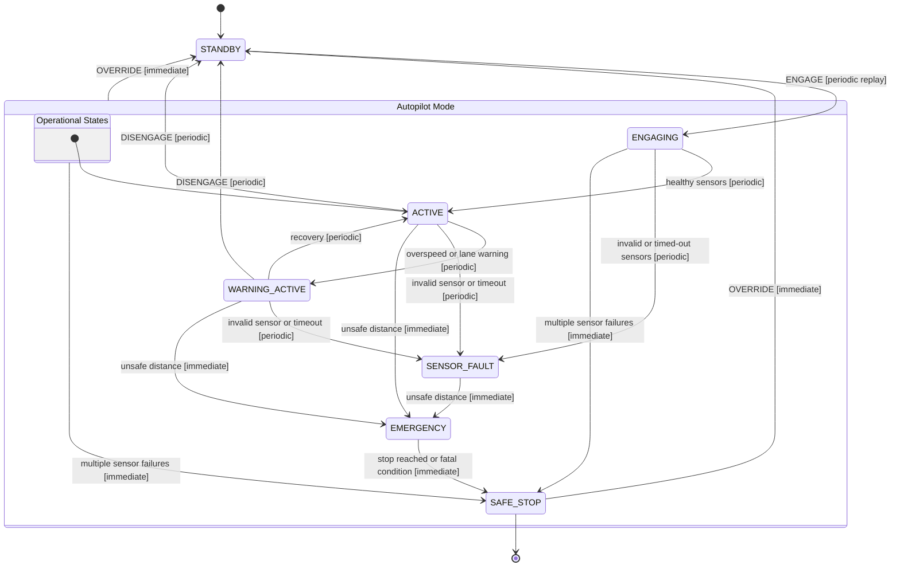

# ADAS State Transition Diagram

This diagram reflects the current implementation after separating warning states from true faults and adding immediate safety transitions for `OVERRIDE` and emergency-safe-stop paths.

To reduce duplication while keeping the layout readable, it uses `super_state` groupings for the overall autopilot mode (`AUTO`) and the monitored operational flow (`OPERATIONAL`).

