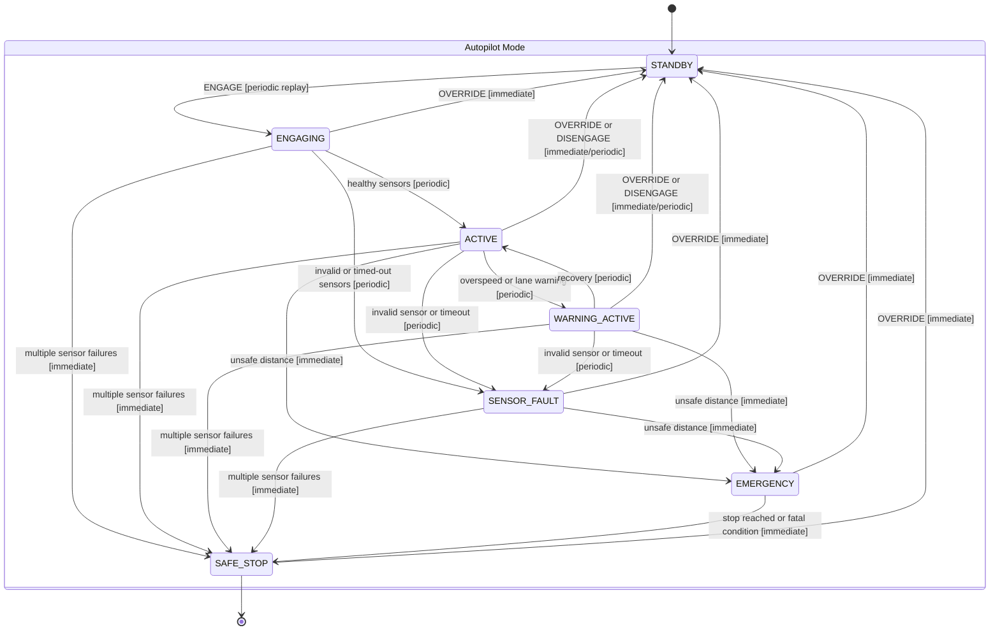

# ADAS State Transition Diagram

This diagram reflects the current implementation after separating warning states from true faults and adding immediate safety transitions for `OVERRIDE` and emergency-safe-stop paths.

