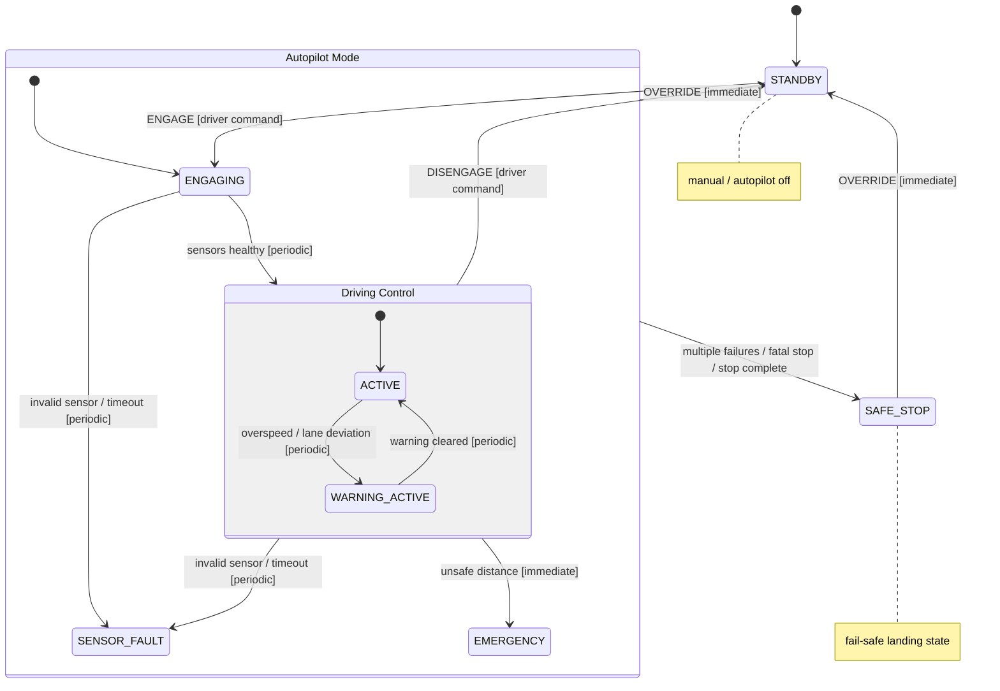

# ADAS State Transition Diagram

This is the simplified state view of the current implementation. It keeps the major operational modes and collapses repeated arrows so the diagram is easier to read.

Notes:

- `STANDBY` is outside `Autopilot Mode` because it represents manual driving or autopilot-off operation.
- `Autopilot Mode` contains `ENGAGING`, `Driving Control`, `SENSOR_FAULT`, and `EMERGENCY`.
- `Driving Control` groups `ACTIVE` and `WARNING_ACTIVE` because both represent autopilot-guided driving with different warning status.
- `SAFE_STOP` is outside `Autopilot Mode` because it is the fail-safe terminal mode for autonomous control.
- `OVERRIDE` is accepted immediately from any current state.
- `DISENGAGE` is only accepted from `ACTIVE` and `WARNING_ACTIVE`.
- This is a readability-first diagram; detailed trigger paths remain in the Ada implementation.
