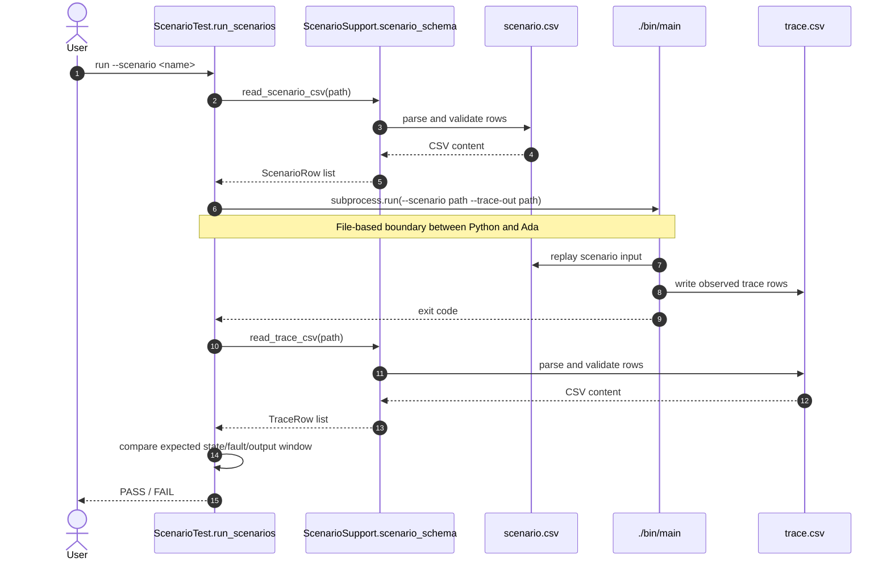

# Python-Ada Sequence Diagram

This diagram keeps the integration boundary intentionally simple:
Python validates scenario input, launches the Ada executable, then validates
the trace produced by Ada.

For Ada-internal runtime behavior, see
[Ada Internal Sequence Patterns](./ada_internal_sequence_patterns.md).

